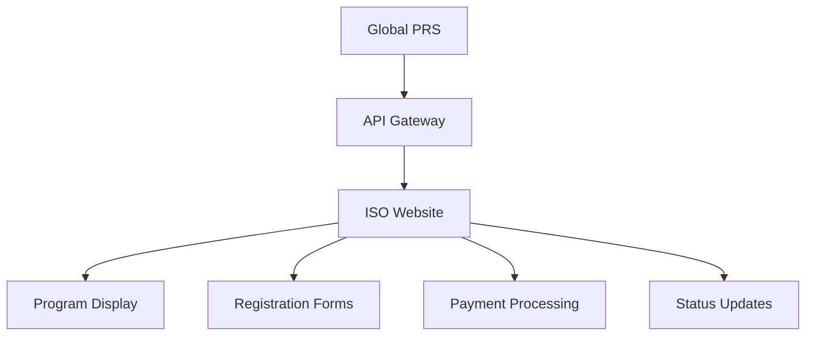

# ISO Website Integration

The integration between Global PRS and the ISO Website (isha.sadhguru.org) enables seamless program registration and management. This guide covers the integration setup, configuration, and best practices.

## Integration Overview

### 1. Key Features
- Program listing and display
- Registration form embedding
- Payment processing
- Status synchronization
- Analytics tracking

### 2. Architecture


## Implementation Guide

### 1. API Configuration
```json
{
  "integration": {
    "type": "iso_website",
    "endpoints": {
      "programs": "/api/v1/programs",
      "registrations": "/api/v1/registrations",
      "webhooks": {
        "registration": "/webhooks/registration",
        "payment": "/webhooks/payment",
        "status": "/webhooks/status"
      }
    },
    "auth": {
      "type": "oauth2",
      "scopes": ["programs.read", "programs.write"]
    }
  }
}
```

### 2. Authentication Setup
1. Obtain API credentials from ISO Website
2. Configure OAuth2 authentication
3. Set up webhook endpoints
4. Test connectivity
5. Monitor authentication status

## Data Flow

### 1. Program Data
- Program details
- Schedule information
- Venue details
- Pricing information
- Availability status

### 2. Registration Data
- Participant information
- Form responses
- Payment details
- Status updates
- Communication preferences

## API Endpoints

### 1. Programs API
```typescript
// Fetch program list
GET /api/v1/programs
{
  "limit": number,
  "offset": number,
  "filters": {
    "status": "active" | "upcoming" | "completed",
    "type": string,
    "location": string
  }
}

// Get program details
GET /api/v1/programs/{programId}
```

### 2. Registration API
```typescript
// Create registration
POST /api/v1/registrations
{
  "programId": string,
  "participant": {
    "name": string,
    "email": string,
    "phone": string
  },
  "formData": object
}

// Update registration status
PUT /api/v1/registrations/{registrationId}/status
{
  "status": "confirmed" | "cancelled" | "completed",
  "reason": string
}
```

## Webhook Events

### 1. Registration Events
- `registration.created`
- `registration.updated`
- `registration.confirmed`
- `registration.cancelled`

### 2. Payment Events
- `payment.initiated`
- `payment.completed`
- `payment.failed`
- `refund.initiated`
- `refund.completed`

## Error Handling

### 1. Common Errors
```typescript
{
  "error": {
    "code": "INVALID_REQUEST",
    "message": "Invalid program ID provided",
    "details": {
      "field": "programId",
      "reason": "Program not found"
    }
  }
}
```

### 2. Error Types
- Authentication errors
- Validation errors
- Rate limit errors
- System errors
- Integration errors

## Best Practices

### 1. Implementation
- Use proper error handling
- Implement retry logic
- Monitor API usage
- Log all transactions
- Regular testing

### 2. Security
- Secure credential storage
- Input validation
- Output sanitization
- Rate limiting
- Access logging

## Monitoring

### 1. Health Checks
- API availability
- Response times
- Error rates
- Authentication status
- Webhook delivery

### 2. Alerts
- System downtime
- High error rates
- Authentication issues
- Rate limit warnings
- Integration failures

## Testing

### 1. Test Environment
```typescript
{
  "api": {
    "baseUrl": "https://uat-api.iso.sadhguru.org",
    "version": "v1",
    "timeout": 30000
  }
}
```

### 2. Test Cases
- API connectivity
- Authentication flow
- Data validation
- Error scenarios
- Webhook delivery

## Troubleshooting

### 1. Common Issues
- Authentication failures
- Webhook delivery issues
- Data synchronization errors
- Rate limit exceeded
- Integration timeout

### 2. Resolution Steps
1. Check API status
2. Verify credentials
3. Review error logs
4. Test connectivity
5. Contact support

## Next Steps

- Configure [MyMedic Integration](/integrations/mymedic)
- Set up [External Systems](/integrations/external-systems)
- Review [API Security](/security/api-security)
- Study [Integration Overview](/integrations/overview)
