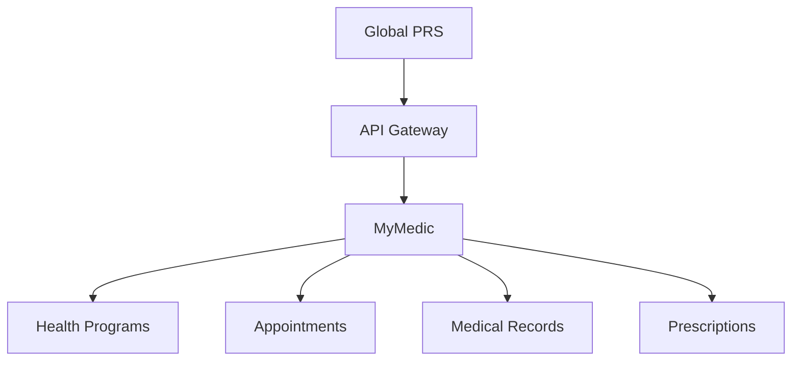

# MyMedic Integration

The integration between Global PRS and MyMedic enables seamless management of health programs, appointments, and participant health data. This guide details the integration setup, configuration, and best practices.

## Integration Overview

### 1. Key Features
- Health program registration
- Appointment scheduling
- Medical record access
- Prescription management
- Follow-up tracking

### 2. Architecture


## Implementation Guide

### 1. API Configuration
```json
{
  "integration": {
    "type": "mymedic",
    "endpoints": {
      "programs": "/api/v1/health-programs",
      "appointments": "/api/v1/appointments",
      "records": "/api/v1/medical-records",
      "webhooks": {
        "appointment": "/webhooks/appointment",
        "prescription": "/webhooks/prescription"
      }
    },
    "auth": {
      "type": "oauth2",
      "scopes": ["programs.read", "appointments.write"]
    }
  }
}
```

### 2. Authentication Setup
1. Obtain MyMedic API credentials
2. Configure OAuth2 authentication
3. Set up webhook endpoints
4. Test connectivity
5. Monitor authentication status

## Data Flow

### 1. Program Data
- Health program details
- Schedule information
- Practitioner details
- Availability slots
- Program requirements

### 2. Appointment Data
- Participant information
- Appointment schedule
- Medical history
- Prescription details
- Follow-up notes

## API Endpoints

### 1. Health Programs API
```typescript
// Fetch health program list
GET /api/v1/health-programs
{
  "limit": number,
  "offset": number,
  "filters": {
    "status": "active" | "upcoming",
    "type": string,
    "practitioner": string
  }
}

// Get program details
GET /api/v1/health-programs/{programId}
```

### 2. Appointments API
```typescript
// Create appointment
POST /api/v1/appointments
{
  "programId": string,
  "participant": {
    "name": string,
    "email": string,
    "phone": string,
    "medicalId": string
  },
  "slot": {
    "date": string,
    "time": string,
    "practitioner": string
  }
}

// Update appointment status
PUT /api/v1/appointments/{appointmentId}/status
{
  "status": "scheduled" | "completed" | "cancelled",
  "notes": string
}
```

## Webhook Events

### 1. Appointment Events
- `appointment.created`
- `appointment.updated`
- `appointment.cancelled`
- `appointment.completed`

### 2. Medical Events
- `prescription.created`
- `prescription.updated`
- `followup.scheduled`
- `record.updated`

## Error Handling

### 1. Common Errors
```typescript
{
  "error": {
    "code": "SLOT_UNAVAILABLE",
    "message": "Selected appointment slot is no longer available",
    "details": {
      "slot": "2025-04-08T10:00:00Z",
      "reason": "Already booked"
    }
  }
}
```

### 2. Error Types
- Scheduling conflicts
- Validation errors
- Authorization errors
- System errors
- Data access errors

## Best Practices

### 1. Implementation
- Validate appointment slots
- Handle timezone differences
- Implement retry logic
- Monitor availability
- Regular sync checks

### 2. Security
- HIPAA compliance
- Data encryption
- Access control
- Audit logging
- Secure transmission

## Monitoring

### 1. Health Checks
- API availability
- Appointment sync
- Record access
- Authentication status
- Webhook delivery

### 2. Alerts
- Sync failures
- Booking conflicts
- System downtime
- Data access issues
- Integration errors

## Testing

### 1. Test Environment
```typescript
{
  "api": {
    "baseUrl": "https://uat-api.mymedic.sadhguru.org",
    "version": "v1",
    "timeout": 30000
  }
}
```

### 2. Test Cases
- Appointment booking
- Schedule conflicts
- Record access
- Prescription flow
- Error scenarios

## Troubleshooting

### 1. Common Issues
- Scheduling conflicts
- Data sync errors
- Access permission issues
- Integration timeouts
- Record mismatch

### 2. Resolution Steps
1. Check API status
2. Verify appointment data
3. Review error logs
4. Test record access
5. Contact support

## Next Steps

- Review [ISO Website Integration](/integrations/iso-website)
- Set up [External Systems](/integrations/external-systems)
- Study [API Security](/security/api-security)
- Explore [Integration Overview](/integrations/overview)
