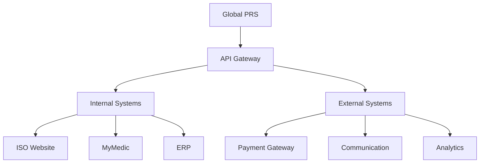

# Integration Overview

The Global PRS system is designed to integrate seamlessly with various internal and external systems. This section provides an overview of available integrations, their configuration, and best practices for implementation.

## Integration Types

### 1. Internal Systems
- ISO Website
- MyMedic
- ERP System
- CRM System
- Volunteer Management System

### 2. External Systems
- Payment Gateways
- Communication Services
- Analytics Platforms
- Third-party APIs
- Verification Services

## Integration Architecture

### 1. Core Components


### 2. Integration Methods
- REST APIs
- Webhooks
- Event streams
- Message queues
- File transfers

## System Integrations

### 1. ISO Website
- Program display
- Registration forms
- Payment processing
- Status updates
- Analytics tracking

### 2. MyMedic
- Health programs
- Appointments
- Medical records
- Prescriptions
- Follow-ups

### 3. ERP System
- Financial data
- Inventory management
- Resource allocation
- Reporting
- Analytics

## Integration Features

### 1. Data Synchronization
- Real-time updates
- Batch processing
- Delta syncs
- Error handling
- Retry mechanisms

### 2. Security
- Authentication
- Authorization
- Encryption
- Access control
- Audit logging

### 3. Monitoring
- Health checks
- Performance metrics
- Error tracking
- Usage analytics
- Alert systems

## Implementation Guide

### 1. Setup Process
1. Integration planning
2. Configuration setup
3. Authentication setup
4. Testing
5. Deployment
6. Monitoring

### 2. Configuration Example
```json
{
  "integration": {
    "type": "iso_website",
    "version": "1.0",
    "config": {
      "endpoint": "https://api.iso.sadhguru.org",
      "auth": {
        "type": "oauth2",
        "clientId": "{{CLIENT_ID}}",
        "scope": "programs.read programs.write"
      },
      "webhooks": {
        "registration": "/webhooks/registration",
        "payment": "/webhooks/payment"
      }
    }
  }
}
```

## Best Practices

### 1. Implementation
- Use standard protocols
- Implement security best practices
- Handle errors gracefully
- Monitor performance
- Document thoroughly

### 2. Data Management
- Validate data
- Handle timeouts
- Implement retries
- Log transactions
- Maintain consistency

### 3. Security
- Secure authentication
- Encrypt sensitive data
- Validate inputs
- Monitor access
- Regular audits

## Error Handling

### 1. Common Scenarios
- Connection failures
- Authentication errors
- Validation failures
- Timeout issues
- System errors

### 2. Recovery Strategies
- Retry mechanisms
- Circuit breakers
- Fallback options
- Error logging
- Alert notifications

## Monitoring & Maintenance

### 1. Health Monitoring
- System status
- Performance metrics
- Error rates
- Response times
- Resource usage

### 2. Maintenance Tasks
- Regular updates
- Security patches
- Performance tuning
- Log rotation
- Backup verification

## Security Considerations

### 1. Authentication
- OAuth 2.0
- API keys
- JWT tokens
- Client certificates
- IP whitelisting

### 2. Data Protection
- Encryption in transit
- Encryption at rest
- Access control
- Data validation
- Audit logging

## Next Steps

- Learn about [ISO Website Integration](/integrations/iso-website)
- Understand [MyMedic Integration](/integrations/mymedic)
- Explore [External Systems](/integrations/external-systems)
- Study [API Security](/security/api-security)
