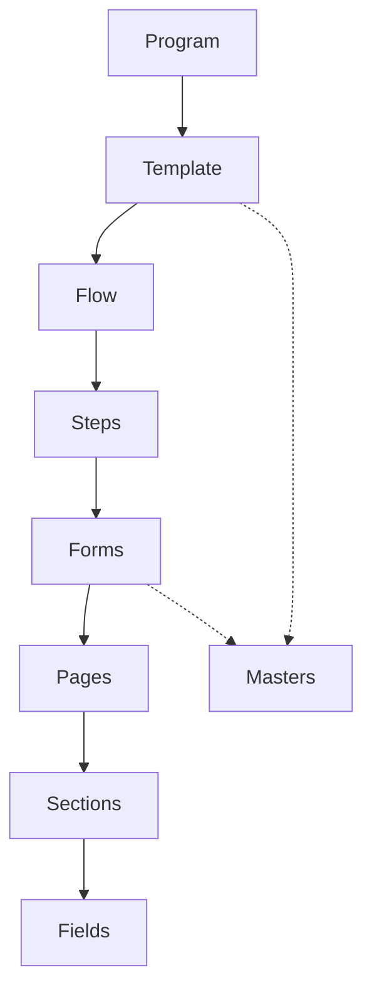

# Core Concepts Overview

The Global PRS system is built on several fundamental modules that work together to create a flexible and powerful program registration system. This section provides an overview of these core concepts and how they interact.

## Key Components

### 1. Programs
Programs are the top-level entities in the Global PRS system. They represent specific instances of Isha programs that participants can register for. Each program is created from a template and contains all the necessary information for registration, scheduling, and management.

### 2. Flows
Flows define the registration journey for participants. They orchestrate the sequence of steps that users need to complete during the registration process. Flows can be customized based on program requirements and can include various types of steps such as forms, payment, and confirmation.

### 3. Steps
Steps are individual components within a flow that participants must complete. Common types of steps include:
- Form filling
- Payment processing
- Document upload
- Verification
- Confirmation

### 4. Forms
Forms are structured data collection interfaces used to gather participant information. They are composed of sections and fields, with built-in validation and conditional logic capabilities.

### 5. Pages
Pages represent the visual structure of the registration process. They can contain one or more sections and provide the layout for presenting information to participants.

### 6. Sections
Sections are logical groupings of fields within a form. They help organize related information and can be conditionally displayed based on program requirements.

### 7. Fields
Fields are the basic data collection units within forms. The system supports various field types with customizable validation rules and display conditions.

### 8. Templates & Masters
- **Templates** are reusable program configurations that can be used to create multiple program instances
- **Masters** are shared configurations that can be referenced across different programs and templates

## Component Relationships

## Key Features

### 1. Modularity
- Components are designed to be modular and reusable
- Templates can be customized for different program needs
- Masters provide consistent configuration across programs

### 2. Flexibility
- Conditional logic for field display and validation
- Customizable flows for different program types
- Configurable validation rules and expressions

### 3. Integration
- Built-in integration points with external systems
- Support for various payment gateways
- API-first design for easy system integration

### 4. Security
- Role-based access control
- Secure data handling
- API security measures

## Next Steps

- Learn about [Program Creation and Management](/modules/programs/overview)
- Understand [Flow Configuration](/modules/flows/overview)
- Explore [Form Building](/modules/forms/overview)
- Study [Field Types and Validation](/modules/fields/overview)
